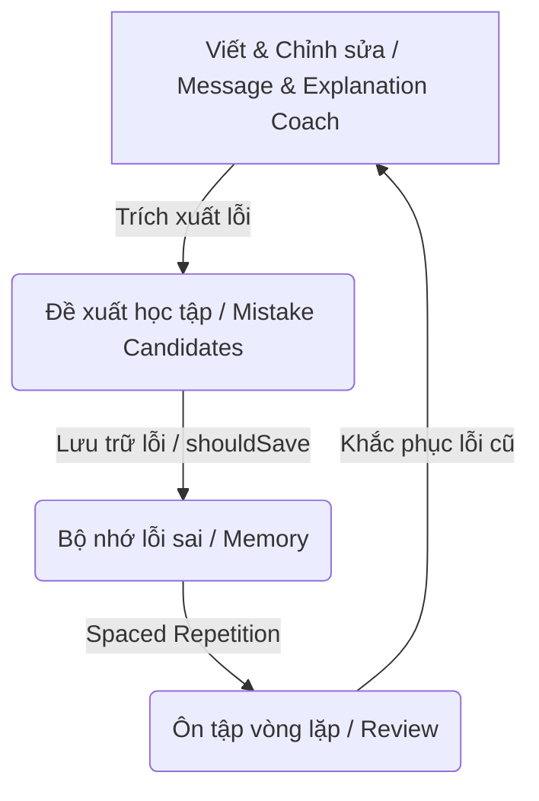

# Lingua Loop

> **Triết lý cốt lõi / Core Philosophy**: Học theo vòng lặp, không quên lỗi cũ (Learn in loops, never forget/repeat old mistakes).

Lingua Loop là ứng dụng hỗ trợ học và viết tiếng Anh chuyên nghiệp dành cho người đi làm tại Việt Nam. Không chỉ dừng lại ở việc chỉnh sửa văn bản tức thời, hệ thống tập trung vào việc **phát hiện, lưu trữ và ôn tập các lỗi sai lặp đi lặp lại** để người học thực sự tiến bộ qua từng vòng lặp.

---

## 🔄 Vòng lặp Học tập (Learning Loop)

Sản phẩm được thiết kế xoay quanh chu trình khép kín:



1. **Coaching**: Người dùng soạn thảo tin nhắn công sở (Message Coach) hoặc tài liệu kỹ thuật (Explanation Coach).
2. **Extraction**: AI không chỉ sửa lỗi mà còn trích xuất các **Mistake Candidates** (mẫu lỗi sai có tính tái sử dụng, phân loại cụ thể).
3. **Saving (Không quên lỗi cũ)**: Hệ thống đánh dấu các lỗi đáng nhớ (`shouldSave: true`) để lưu vào **Memory**.
4. **Reviewing (Học theo vòng lặp)**: Người học ôn tập định kỳ thông qua **Review Workflow** (Spaced Repetition) để xóa bỏ hoàn toàn lỗi sai đó khỏi thói quen viết.

---

## 🛠️ Tính năng hiện tại (MVP v0)

- **Message Coach**: Tối ưu hóa tin nhắn ngắn cho Slack, Teams, Email theo nhiều tông giọng (Friendly, Polite, Direct, Professional, Casual).
- **Explanation Coach**: Chuẩn hóa cấu trúc và từ vựng cho tài liệu kỹ thuật dài (Issue descriptions, PR descriptions, Tech specs, Jira comments).
- **Lưu trữ cục bộ & Đề xuất lỗi**: Trích xuất lỗi sai trực tiếp dưới dạng thẻ học để người học ghi nhớ ngay.

---

## 🚀 Kế hoạch phát triển (Roadmap)

- **MVP v1**:
  - **Reading Coach**: Phân tích ý nghĩa, thành ngữ và tông giọng của đối tác trong email/chat.
  - **Memory & Review**: Tích hợp cơ sở dữ liệu để lưu trữ thẻ lỗi cá nhân hóa và bắt đầu vòng lặp ôn tập cơ bản.
- **Later**:
  - Hệ thống nhắc nhở ôn tập thông minh (Spaced Review).
  - Dashboard theo dõi tiến độ giảm thiểu lỗi sai.

---

## 💻 Phát triển mã nguồn (Development)

### Cài đặt môi trường

Đảm bảo bạn đã cài đặt các thư viện cần thiết bằng `pnpm`:

```bash
pnpm install
```

### Chạy ứng dụng locally

```bash
pnpm dev
```

### Kiểm tra & Đánh giá AI (Evaluation)

Các script dùng để chạy thử nghiệm prompt và đo lường độ chính xác của mô hình Gemini:

```bash
pnpm eval:message       # Đánh giá Message Coach
pnpm eval:explanation   # Đánh giá Explanation Coach
```

### Kiểm thử & Định dạng

```bash
pnpm typecheck          # Kiểm tra kiểu dữ liệu TypeScript
pnpm lint               # Kiểm tra tiêu chuẩn code
pnpm test               # Chạy unit & contract tests
```
