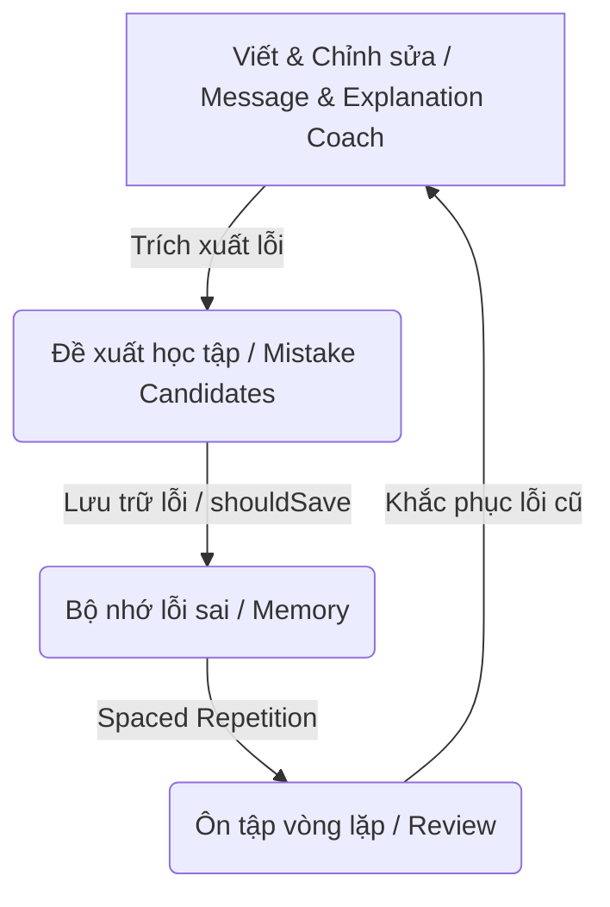

# Lingua Loop

> **Triết lý cốt lõi / Core Philosophy**: Học theo vòng lặp, không quên lỗi cũ (Learn in loops, never forget/repeat old mistakes).

Lingua Loop là ứng dụng hỗ trợ học và viết tiếng Anh chuyên nghiệp dành cho người đi làm tại Việt Nam. Không chỉ dừng lại ở việc chỉnh sửa văn bản tức thời, hệ thống tập trung vào việc **phát hiện, lưu trữ và ôn tập các lỗi sai lặp đi lặp lại** để người học thực sự tiến bộ qua từng vòng lặp.

---

## 🔄 Vòng lặp Học tập (Learning Loop)

Sản phẩm được thiết kế xoay quanh chu trình khép kín:



> [!NOTE]
> Ở phiên bản hiện tại (**MVP v1.1**), hệ thống đã hoàn thiện vòng lặp học tập khép kín bằng local storage, hỗ trợ lưu trữ thật, trích xuất candidates từ cả 3 coaches (Email & Message, Document, Reading) và ôn tập dãn cách (SRS) với AI semantic grading và ghi đè tự chấm của người dùng.

1. **Coaching**: Người dùng soạn thảo tin nhắn công sở (Email & Message Coach), tài liệu kỹ thuật (Document Coach), hoặc phân tích bài đọc (Reading Coach).
2. **Extraction**: AI không chỉ sửa lỗi mà còn trích xuất các lỗi viết sai (`writing_mistake`), cụm từ hữu ích (`reusable_phrase`), hoặc bẫy đọc hiểu (`reading_trap`).
3. **Saving (Không quên lỗi cũ)**: Lưu trữ các lỗi này vào **Memory** (Sổ tay lỗi sai) bằng localStorage.
4. **Reviewing (Học theo vòng lặp)**: Người học ôn tập định kỳ thông qua **Review Workflow** sử dụng thuật toán ôn tập dãn cách (Spaced Repetition SM-2) và chấm điểm tự động bằng AI (AI semantic grading).

---

## 🛠️ Tính năng hiện tại (MVP v1.1)

- **Email & Message Coach**: Tối ưu hóa tin nhắn ngắn cho Slack, Teams, Email theo nhiều tông giọng (Friendly, Polite, Direct, Professional, Casual).
- **Document Coach**: Chuẩn hóa cấu trúc và từ vựng cho tài liệu kỹ thuật dài (PR descriptions, Tech specs, Jira comments).
- **Reading Coach**: Phân tích ý nghĩa, thành ngữ, bẫy dịch nghĩa và tông giọng của đối tác, trích xuất bẫy đọc hiểu (`reading_trap`) và cụm từ khuyên dùng (`reusable_phrase`).
- **Sổ tay lỗi sai (Memory)**: Quản lý 3 nhóm thẻ nhớ (`writing_mistake`, `reusable_phrase`, `reading_trap`) phân biệt theo nguồn học và trạng thái học tập. Hỗ trợ Xuất/Nhập file JSON để backup dữ liệu.
- **Ôn tập dãn cách (Review)**: Ôn tập bằng AI chấm điểm ngữ nghĩa linh hoạt (Semantic Grading), hỗ trợ gợi ý chữ cái đầu, re-queue thẻ sai xuống cuối hàng, tự động cập nhật lịch ôn dãn cách, và cho phép người dùng tự ghi đè (override) kết quả tự chấm.

---

## 🚀 Kế hoạch phát triển tiếp theo (Roadmap)

- **Database Persistence**: Thay thế local storage bằng cơ sở dữ liệu thật để tránh mất mát dữ liệu và cho phép đồng bộ đa thiết bị.
- **Login/Sync**: Đăng nhập tài khoản.
- **Review History**: Theo dõi lịch sử ôn tập chi tiết qua biểu đồ và thống kê.

---

## 💻 Phát triển mã nguồn (Development)

### Cài đặt môi trường

Đảm bảo bạn đã cài đặt các thư viện cần thiết bằng `pnpm`:

```bash
pnpm install
```

### Chạy ứng dụng locally

```bash
pnpm dev
```

### Kiểm tra & Đánh giá AI (Evaluation)

Các script dùng để chạy thử nghiệm prompt và đo lường độ chính xác của mô hình Gemini:

```bash
pnpm eval:message       # Đánh giá Message Coach
pnpm eval:explanation   # Đánh giá Explanation Coach
```

### Kiểm thử & Định dạng

```bash
pnpm typecheck          # Kiểm tra kiểu dữ liệu TypeScript
pnpm lint               # Kiểm tra tiêu chuẩn code
pnpm test               # Chạy unit & contract tests
```
